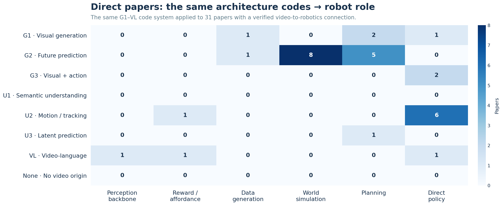

# From Video Models to Robotics

[한국어](https://2seungeun.github.io/2seungeun/notes/01-video-to-robotics-transition/) | **English**

By <a class="article-author" href="https://www.linkedin.com/in/lee-seungeun" target="_blank" rel="author me noopener">Seungeun Lee</a> · <time datetime="2026-09-01">September 1, 2026</time>

This note began with the impression that many people who worked on video were moving into robotics. Current affiliations alone did not tell that story very well. I needed to look at the video problems each researcher had worked on and where that experience later appeared in robotics.

This note covers 56 researchers and 66 papers. These are not one-to-one lists: a paper can have several relevant authors, and a researcher can appear on several papers. I selected one representative video paper and one representative robotics paper only when making researcher-level comparisons.

The papers are grouped by how they are used in the analysis.

| Paper group | Count | Meaning | Spreadsheet label |
|---|---:|---|---|
| Direct bridge papers | 31 | The paper itself shows a video representation, prediction, or generation mechanism being used for a robotics problem | Yes |
| Context and lineage papers | 22 | No direct robotics transfer is demonstrated, but the paper is needed to trace or compare the technical lineage | Adjacent |
| One-side reference papers | 13 | A representative video-side or robotics-side paper used to establish a researcher's starting point or destination | No |

## The boundary was blurring more than people were switching fields

Each of the 56 researchers is assigned to exactly one of four transition types.

| Type | Count | Meaning in this note |
|---|---:|---|
| Switcher | 2 | The primary topic or organization clearly moved from video toward robotics or world models |
| Bridger | 39 | Produced important work on both sides or directly connected the technologies |
| Native hybrid | 11 | Worked on video and robotics together from a relatively early stage |
| Robotics-first | 4 | Robotics-centered comparison cases with no verified video-origin paper |
| **Total** | **56** | Each researcher is counted once |

Only two people fit a narrow definition of switching fields. The more common pattern was a Bridger moving between both areas or carrying a structure developed for video into a robotics problem. This looks less like a mass migration and more like two research areas becoming tightly entangled.

## Similar video models took on different roles in robotics

At first, I thought a split between video generation and video understanding would be enough. Once the papers were laid out together, however, the paths within those categories turned out to be different.

Video models that generate or predict future scenes tended to lead toward world simulation and planning. Models such as V-JEPA predict the future without reconstructing pixels, so I separated them from conventional video generation as `latent prediction`. Models trained on motion or tracking often connected to robotic perception, affordance, and video-conditioned policies. I treated video-language as a separate path as well: it aligns video and language into representations used for reward or reasoning, rather than directly producing actions like a VLA model.

The vertical code axis answers one question only: **which video-side architecture the researcher or paper brings into robotics**. If a robot model emits actions, that information appears in the `Direct policy` column rather than creating another code. Track2Act is therefore U2 → Direct policy because it carries over point tracking, while GR-2 is G3 → Direct policy because it jointly generates visual states and actions.

### Video-origin architecture codes

| Code | Short meaning | Boundary | Common robotics role |
|---|---|---|---|
| G1 | Visual generation | Generates image or video pixels or tokens; robot action is not a central input | Synthetic data, visual subgoals, video plans |
| G2 | Action-conditioned future prediction | Action may be an input, but the output is future video or state rather than action | World simulation, planning |
| G3 | Joint visual-action generation | Future visual states and actions are emitted together | Direct policy |
| U1 | Semantic and action understanding | Represents events, actions, or scene meaning | Perception backbone |
| U2 | Motion and tracking understanding | Represents motion, point tracks, interactions, or affordance | Perception, reward, policy conditioning |
| U3 | Latent future prediction | Predicts future representations rather than reconstructing pixels | Latent planning |
| VL | Video-language | Aligns temporal video information with language or reasons over both | Reward, reasoning, policy conditioning |
| None | No verified video origin | Robotics comparison case or no video lineage could be verified | Comparison only |

Within the generative family, action position separates G1, G2, and G3. G1 generates video without action as a central condition. G2 takes action as a condition but predicts future video. G3 jointly generates visual states and actions. Final robot outputs are represented by robot roles rather than by another code system.

<strong>Game-oriented G2 boundary cases</strong> <em>(expand)</em>

<a href="https://arxiv.org/abs/2408.14837">GameNGen</a> and <a href="https://arxiv.org/abs/2402.15391">Genie</a> are G2 because they generate the next visual state from past frames and actions, or from latent actions learned from video. Neither paper demonstrates transfer to a robot or physical system. They remain useful context for the technical lineage but are excluded from the 31 direct bridge papers. <strong>Being G2</strong> and <strong>showing a robotics transfer</strong> are separate judgments.

## G1 researchers reached planning most often, while direct papers were dominated by G2

Both figures use the same architecture codes and the same robot roles. The first counts 56 researchers; the second counts the 31 direct bridge papers. G3 is zero among representative researcher starting points, while GR-2 and Cosmos Policy appear as two G3 → Direct policy papers in the paper-level chart.

G1 → Planning contains six researchers: Yilun Du, Jiajun Wu, Karthik Dharmarajan, Ruohan Zhang, Sherry Yang, and Wenlong Huang.

At paper level, G1 maps to one data-generation paper, two planning papers, and one direct-policy paper. G2 maps to one data-generation paper, eight world-simulation papers, and five planning papers.

At researcher level, G1 maps to planning for six people, direct policy for four, and world simulation for three. G2 maps to world simulation for six, with two each in planning, direct policy, and data generation. G1 researchers reached planning most often, but the direct paper set contains far more G2 papers (14) than G1 papers (4). The clearest paper-level path in this sample runs from **action-conditioned future prediction to world simulation and planning**.

Separating generation, understanding, and video-language—and then tracing their roles in robotics—changed my initial impression. The larger pattern seems to be less about people moving fields and more about **representations and predictive structures learned from video moving into robotic world models, planning, and policies**.

## Reference

The spreadsheet contains the 56-researcher table, the 66-paper table, researcher and paper matrices built from one code system, transition counts, classification rules, and source links.

- [Download the research data](video_to_robotics_architecture_pilot.xlsx)
- Citation snapshot: September 2, 2026

### I looked at both cumulative and age-adjusted citations

All citation counts use the [OpenAlex](https://openalex.org/) cited_by_count snapshot from September 2, 2026. Different scholarly search services merge paper versions differently, so these are source-specific values intended for comparison within one snapshot.

Cumulative citations favor older papers. I therefore added a simple age-adjusted view:

$$
\text{Citations per year}
= \frac{\text{Observed citations}}
{\max(1,\ 2026-\text{publication year}+1)}
$$

Under this convention, a 2025 paper is in its second publication year and a 2023 paper in its fourth. This is not a month-level citation velocity or a field-normalized metric; it is only a rough check on paper age.

The researcher score is calculated only when the representative video and robotics papers are **two distinct papers**:

$$
\text{Bridge Impact}
= \sqrt{(C_{video}+1)(C_{robotics}+1)} \times w_{evidence}
$$

Evidence_strength receives a weight of 1.0 for High and 0.8 for Medium. High means direct authorship on both sides or a verified official project role. Medium means one side relies on a team announcement, a recent project page, an indirect technical lineage, or authorship that could not be verified with enough confidence. The 0.8 weight is a conservative rule, not a statistically estimated coefficient.

When a single paper directly bridges video and robotics, it remains an important bridge case. The ranking, however, compares influence verified through two distinct papers, so single-paper cases are reported separately rather than scored. The 56 researchers divide as follows:

| Score-data status | Count | Ranking treatment |
|---|---:|---|
| Two distinct representative papers covered | 24 | Ranked only when Important_both=Yes; 20 people qualify |
| One bridge paper used on both sides | 22 | Excluded |
| Representative paper or citation input partially missing | 10 | Excluded |
| **Total** | **56** |  |

Under this rule, Chelsea Finn and Sergey Levine are tied for first, Thomas Brox is third, and Frederik Ebert and Sudeep Dasari are tied for fourth. Agrim Gupta is tied for seventh.

### These numbers should not be read as a general ranking

Bridge Impact first selects people with important work visible on both the video and robotics sides, then scores that intersection. Researchers already known in both areas are likely to rank highly partly because of that sampling rule. The metric is not designed to discover new switchers independently or to measure overall career impact.

Selecting one or two representative papers also leaves out contributions, and citation counts cannot separate the roles of individual coauthors. Papers from 2025–2026 can change position quickly. Cumulative citations, the age-adjusted view, and the qualitative evidence should therefore be read together.

© 2026 Seungeun Lee. All rights reserved.

