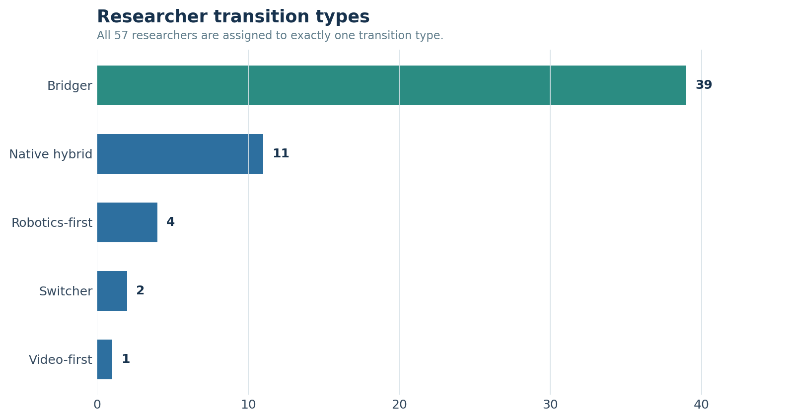
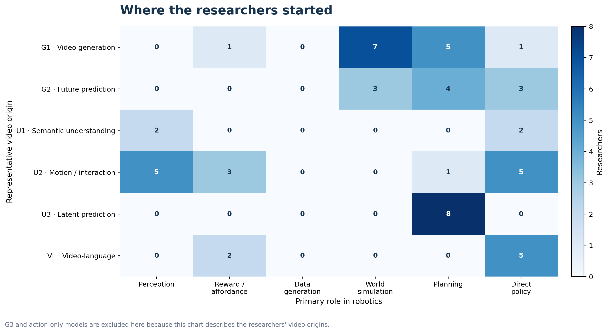
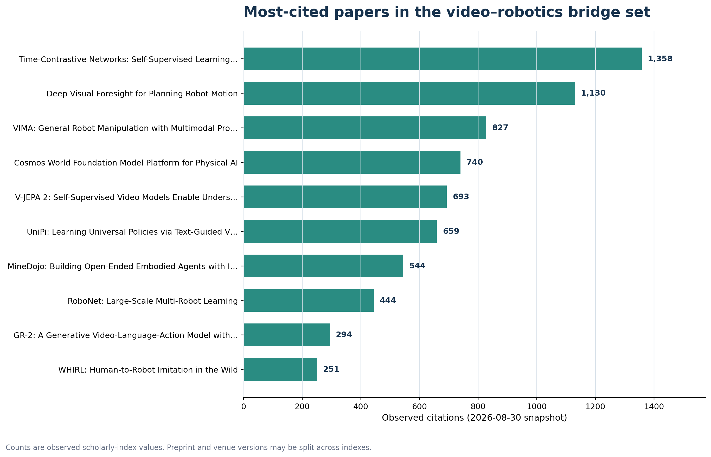

# 비디오 모델은 어떻게 로보틱스로 이어졌나

> 생성, 이해, 비디오-언어 연구자의 전환 경로를 연구자와 논문 단위로 정리한 노트

처음에는 “비디오를 하던 사람들이 요즘 로보틱스로 많이 넘어간 것 같다”는 인상에서 시작했다. 그래서 비디오 쪽의 출발 아키텍처, 로보틱스에서 맡는 역할, 대표 논문의 영향력을 따로 기록하며 확인해보기로 했다.

정리한 원본은 아래 엑셀 파일에 있다. 연구자 57명과 논문 40편을 담았고, 표 안의 URL을 따라가면 판단 근거를 다시 확인할 수 있다.

- [video_to_robotics_architecture_pilot.xlsx](video_to_robotics_architecture_pilot.xlsx)
- 조사 기준일: 2026-08-30

## 먼저 보인 것

엄밀한 의미의 “분야 전환”은 생각보다 많지 않았다. 소속이나 연구 주제가 비디오에서 로보틱스로 뚜렷하게 바뀐 경우는 57명 중 2명이었다. 반면 두 분야에서 중요한 작업을 했거나, 비디오 아키텍처를 로봇 문제에 직접 옮긴 **Bridger**는 42명이었다. 따라서 이 현상을 설명할 때는 ‘연구 경계의 결합’이라고 부르는 편이 정확해 보인다. 그리고 나 역시도 그런 관점에서 비디오 -> 월드 모델 -> 로보틱스로 관심 분야가 자연스레 옮겨졌다.

또 하나는 비디오 생성과 비디오 이해가 로보틱스로 들어가는 경로가 꽤 다르다는 점이다. 모션·트래킹 중심의 비디오 이해는 로봇의 인지, 어포던스, 비디오 조건부 정책으로 연결되었고, 비디오 생성 계열은 미래 장면이나 상태를 만들기 때문에 월드 시뮬레이션과 계획으로 이어지는 경우가 많았다. 하지만 비디오 생성 역시도 V-JEPA 계열처럼 픽셀이 아니라 latent representation을 예측하는 모델은 픽셀 재현을 목적으로 하지 않기 때문에 전통적인 비디오 생성과도 구분할 필요가 있었다. 이쪽은 latent world model과 planning에 가깝기 때문이다. 그리고 비디오와 언어를 정렬하는 Video-language도 별도의 축으로 봐야할 것 같았다. 비디오와 언어를 정렬해 얻은 표현이 reward, reasoning, policy conditioning에 쓰이는 경우가 있기 때문이었다. 물론, VLA처럼 곧바로 action을 출력하는 모델과도 구분했다.

아래 그림은 연구자마다 하나의 대표 출발 아키텍처와 하나의 로보틱스 역할을 부여해 센 것이다. G1–G3는 생성, U1–U3는 이해 및 예측 표현, VL은 video-language를 뜻한다.

## 누구를 포함했나

연구자를 넣을 때는 다음 중 하나가 확인되는 경우를 우선했다.

1. 비디오 생성·예측·이해 분야에서 대표 논문을 쓴 뒤 로봇 학습이나 embodied AI에서 중요한 작업을 한 경우
2. 같은 연구 흐름 안에서 비디오 모델을 로봇의 인지, reward, 데이터 생성, world simulation, planning, policy에 명시적으로 사용한 경우
3. 유럽의 주요 연구 클러스터에서 위 연결을 보여 주는 경우. Paris–London–Oxford–Freiburg를 중심으로 확인했다.

반대로 컴퓨터 비전과 로보틱스를 모두 했다는 이유만으로 넣지는 않았다. 소속이 로봇 조직으로 바뀌었다는 사실만으로도 전환으로 보지 않았다. 직접적인 논문이나 프로젝트 근거가 약한 경우에는 `Medium` 또는 `Partial / missing coverage`로 남겼다. 로보틱스에서 중요하지만 비디오 출발점이 약한 연구자는 비교를 위한 control로 일부 포함했다.

## 아키텍처 분류

비디오 축을 생성과 이해로 먼저 나누고, 그 안에서 모델이 무엇을 출력하거나 예측하는지에 따라 세분화했다.

| 코드 | 의미 | 로보틱스에서 주로 이어진 역할 |
|---|---|---|
| G1 | RGB 또는 video token 생성 | synthetic data, visual subgoal, video plan |
| G2 | action-conditioned future video/state 예측 | world simulation, planning |
| G3 | video와 action의 공동 생성 | direct policy |
| U1 | action·event·semantic 이해 | perception backbone |
| U2 | motion·tracking·interaction·affordance | perception, reward, policy condition |
| U3 | masked future/latent representation 예측 | latent planning |
| VL | video-text alignment와 reasoning | reward, reasoning, policy conditioning |
| A | action trajectory/token 생성 | direct policy; 비디오 생성 출발의 근거로는 쓰지 않음 |

이렇게 나누면 “비디오 모델이 로봇에 쓰였다”는 한 문장 안에 서로 다른 구조가 섞이는 것을 피할 수 있다. 특히 U3는 미래를 예측하지만 픽셀을 생성하지 않으므로 G1/G2와 합치지 않았다.

## 논문과 연구자 정렬 기준

논문은 먼저 실제 비디오–로보틱스 연결이 있는 `Bridge_flag=Yes`를 모은 뒤 관측 인용수 순으로 정렬했다. 오래된 논문에 유리한 점을 확인할 수 있도록 `Citations_per_year`도 함께 넣었다. 인용수는 학술 검색 인덱스에서 확인한 스냅숏 값이라 arXiv와 학회·저널 버전이 분리되면 서비스마다 숫자가 달라질 수 있다.

연구자 순위는 전체 커리어 인용수가 아니라 이 노트의 주제에 맞는 **bridge impact**를 보려는 것이다. 먼저 비디오와 로보틱스 양쪽에서 중요하다고 확인된 사람을 앞에 두고, 각 분야의 대표 논문 인용수로 다음 점수를 계산했다.

$$
\text{Bridge Impact}
= \sqrt{(C_{video}+1)(C_{robotics}+1)} \times w_{evidence}
$$

`High` 근거는 1.0, `Medium`은 0.8을 곱했다. 기하평균을 쓴 이유는 한쪽 논문만 인용수가 높은 사람이 과도하게 올라가는 것을 줄이기 위해서다. 이 기준에서 상위에는 Chelsea Finn, Sergey Levine, Ming-Yu Liu, Oier Mees, Thomas Brox가 놓였다. Agrim Gupta는 17위였다. 처음 떠올린 사례라는 이유로 1위가 되지 않도록 정렬 기준을 다시 잡은 결과다.

다만 이 순위 역시 절대적인 연구자 서열은 아니다. 대표 논문을 한두 편만 고르는 과정에서 손실이 생기고, 같은 bridge paper가 비디오와 로보틱스 양쪽 근거가 되는 경우도 있다. 새 논문은 아직 인용이 쌓이지 않았고, 공동저자 기여도도 인용수만으로는 구분되지 않는다. 따라서 숫자는 후보를 좁히고 흐름을 보는 용도로 쓰는 편이 맞다.

## Limitation

- 이 표본은 전수조사가 아니라 핵심 연구자와 비교군을 고른 purposive sample이다.
- 현재 소속이나 국적 통계가 아니다. 지역은 해당 연구 클러스터 또는 대표 논문의 맥락으로 기록했다.
- 인용수는 계속 바뀐다. 특히 2025–2026년 논문은 몇 달 뒤 순위가 크게 달라질 수 있다.
- 연구자 단위의 정렬보다 논문–저자 그래프를 만들고, 공동저자 네트워크와 시간축을 함께 보는 방식이 다음 단계에 더 적합하다.

그래도 생성, 이해, video-language를 한 덩어리로 세지 않고 로보틱스에서의 역할까지 연결해 보니, 막연히 느꼈던 “비디오 인력이 로봇으로 간다”는 현상이 조금 더 구체적으로 보였다. 사람의 이동보다는 **비디오에서 배운 표현과 예측 구조가 로봇의 world model, planning, policy로 옮겨가는 과정**이 더 큰 흐름에 가깝다.

