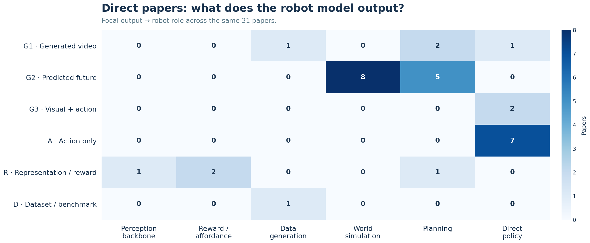

# 비디오 모델은 어떻게 로보틱스로 이어졌나

**한국어** | [English](https://2seungeun.github.io/2seungeun/notes/01-video-to-robotics-transition/english.html)

By <a class="article-author" href="https://www.linkedin.com/in/lee-seungeun" target="_blank" rel="author me noopener">이승은</a> · <time datetime="2026-09-01">2026년 9월 1일</time>

비디오를 하던 사람들이 로보틱스로 많이 넘어간 것 같다는 인상에서 시작했다. 그런데 사람의 현재 소속만 따라가서는 이 흐름이 잘 보이지 않았다. 원래 어떤 비디오 문제를 풀었는지, 그 경험이 로봇에서 어디에 쓰였는지를 함께 봐야 했다.

이 글이 다루는 표본은 연구자 57명과 논문 66편이다. 둘은 1:1 목록이 아니다. 한 논문에 여러 연구자가 있고, 한 연구자도 여러 논문에 걸친다. 연구자 단위 비교를 할 때만 대표 비디오 논문과 대표 로보틱스 논문을 한 편씩 골랐다.

논문은 쓰임에 따라 세 묶음으로 나눴다.

| 논문 묶음 | 편수 | 뜻 | 엑셀 표기 |
|---|---:|---|---|
| 직접 연결 논문 | 31 | 논문 안에서 비디오의 표현·예측·생성 구조가 로봇 문제에 쓰인 것이 확인됨 | Yes |
| 흐름을 설명하는 주변 사례 | 22 | 로봇 실험은 없거나 직접 연결은 아니지만, 기술 계보와 비교에 필요함 | Adjacent |
| 한쪽 분야의 기준 논문 | 13 | 비디오 또는 로보틱스 한쪽의 대표 작업으로, 연구자의 출발점과 도착점을 확인하는 데 사용함 | No |

## 전환이라기보다는 경계가 섞이고 있었다

57명은 겹치지 않게 다섯 유형 중 하나에만 넣었다.

| 유형 | 인원 | 이 글에서의 의미 |
|---|---:|---|
| Switcher | 2 | 주 연구 주제나 조직이 비디오에서 로보틱스·월드 모델로 뚜렷하게 이동 |
| Bridger | 39 | 두 분야에서 중요한 작업을 했거나 기술을 직접 연결 |
| Native hybrid | 11 | 비교적 이른 시기부터 비디오와 로보틱스를 함께 연구 |
| Robotics-first | 4 | 로보틱스가 중심이며 확인 가능한 비디오 출발 논문이 없는 비교군 |
| Video-first | 1 | 비디오·가상 embodied agent 작업은 확인되지만 물리 로봇 논문은 확인하지 못한 비교군 |
| **합계** | **57** | 각 연구자는 한 번만 셈 |

좁은 뜻의 ‘전환’에 해당하는 사람은 2명이었다. 더 흔한 경우는 비디오와 로보틱스를 오가거나, 비디오에서 쓰던 구조를 로봇 문제로 가져온 Bridger였다. 그래서 대규모 인력 이동보다는 두 연구 영역의 경계가 빠르게 섞이고 있다고 보는 편이 맞다.

## 같은 비디오 모델이라도 로봇에서 맡는 역할은 달랐다

처음에는 비디오 생성과 이해 정도만 나누면 될 줄 알았다. 그런데 논문을 모아 놓고 보니 그 안에서도 경로가 달랐다.

비디오 생성에서 미래 장면을 생성하거나 예측하는 모델은 world simulation과 planning 쪽으로 이어졌다. V-JEPA처럼 미래를 예측하더라도 픽셀을 복원하지 않는 모델은 일반적인 비디오 생성과 묶기 어려워 `latent prediction`으로 따로 뒀다. 모션이나 트래킹을 배우는 모델은 로봇의 perception, affordance, video-conditioned policy로 연결되는 경우가 많았다. Video-language는 영상과 언어를 정렬해 얻은 표현이 reward나 reasoning에 쓰이는 흐름이라, 바로 action을 출력하는 VLA와는 구분했다.

그림에 쓴 코드는 아래처럼 읽으면 된다. 생성·예측 계열은 **무엇을 만들도록 학습했는지**와 **action이 입력과 출력 중 어디에 놓이는지**를 함께 보고 G1, G2, G3, A로 나눴다.

여기서 ‘비디오 메커니즘’은 **로봇 논문이 비디오 연구에서 무엇을 가져왔는가**를, ‘최종 출력’은 **그 로봇 모델이 실제로 무엇을 내놓는가**를 묻는다. G1과 G2 논문은 두 답이 같은 경우가 많아 얼핏 중복처럼 보인다. 예를 들어 UniPi는 비디오 생성 구조를 가져와 비디오 계획을 출력하므로 G1 → G1이고, Visual Foresight는 action-conditioned video prediction을 가져와 미래 영상을 출력하므로 G2 → G2다.

차이는 Track2Act 같은 논문에서 분명해진다. 이 논문은 인터넷 비디오에서 포인트 트랙을 배우므로 비디오 메커니즘은 U2지만, 로봇 모델의 최종 출력은 action이므로 A다. 첫 번째 표만 보면 비디오에서 가져온 기술은 보이지만 최종 정책 구조가 가려지고, 두 번째 표만 보면 action policy라는 사실만 남아 비디오 계보가 사라진다. 그래서 같은 31편을 **출발점과 도착점이라는 두 질문**으로 나눠 본다.

1. **비디오에서 가져온 메커니즘**: 무엇을 보고 배우거나 예측했는가
2. **해당 논문의 최종 출력**: 실제로 무엇을 내보내는가
3. **로봇에서의 역할**: perception, reward, data generation, world simulation, planning, direct policy 중 어디에 쓰이는가

### 비디오에서 무엇을 가져왔나

| 코드 | 짧은 뜻 | 구분 기준 | 로봇에서 자주 맡는 역할 |
|---|---|---|---|
| G1 | 영상 생성 | 이미지·비디오 픽셀이나 토큰을 생성하며, 로봇 action은 핵심 입력이 아님 | 합성 데이터, visual subgoal, video plan |
| G2 | action 조건 미래 예측 | action을 입력으로 받을 수 있지만 출력하지 않고, 미래 영상·상태를 예측 | world simulation, planning |
| G3 | 영상·action 공동 생성 | 미래 시각 상태와 action을 함께 출력 | direct policy |
| U1 | 의미·행동 이해 | 장면의 사건, 행동, 의미를 표현 | perception backbone |
| U2 | 모션·트래킹 이해 | 움직임, 포인트 트랙, 상호작용, affordance를 표현 | perception, reward, policy condition |
| U3 | latent 미래 예측 | 픽셀 대신 미래의 잠재 표현을 예측 | latent planning |
| VL | video-language | 영상의 시간 정보와 언어를 정렬하거나 함께 추론 | reward, reasoning, policy conditioning |
| None | 확인된 비디오 출발점 없음 | 로보틱스 비교군이거나 비디오 계보를 확인하지 못함 | 비교용 |

생성 계열에서는 action이 들어가는지 자체보다 **무엇을 출력하는지**를 기준으로 G1, G2, G3를 갈랐다. G1은 시각 결과만 만들고 action이 핵심 조건이 아니다. G2는 action을 조건으로 받을 수 있지만 미래 시각 상태를 출력한다. G3는 시각 상태와 action을 함께 출력한다.

### 로봇 논문은 무엇을 출력하나

| 코드 | 논문이 내놓는 것 | 읽을 때 주의할 점 |
|---|---|---|
| G1 | 생성된 이미지·비디오 | visual plan이나 합성 데이터가 될 수 있음 |
| G2 | 예측된 미래 영상·상태 | action은 조건일 수 있으나 출력은 아님 |
| G3 | 미래 영상·상태와 action | 시각 상태와 action을 공동 생성 |
| A | action trajectory 또는 action token | action만 출력 |
| R | representation, reward, value, latent | 중간 표현이나 평가 신호 |
| D | dataset 또는 benchmark | 모델 출력으로 억지 분류하지 않음 |

G3와 A는 모두 direct policy로 이어질 수 있다. 로봇에서의 역할이 달라서 나눈 것이 아니라 **출력 모달리티와 학습 구조가 다르기 때문**이다. G3는 미래 시각 상태와 action을 함께 만들고, A는 action만 만든다.

<strong>게임형 G2의 경계 사례</strong> <em>(자세히 보기)</em>

<a href="https://arxiv.org/abs/2408.14837">GameNGen</a>과 <a href="https://arxiv.org/abs/2402.15391">Genie</a>는 과거 화면과 action, 또는 영상에서 배운 latent action을 조건으로 다음 화면을 만들기 때문에 G2에 해당한다. 다만 두 논문 자체에는 로봇이나 물리 시스템으로의 전이가 없다. 기술 흐름을 보여주는 주변 사례에는 넣되, 직접 연결 논문 31편에서는 제외했다. <strong>G2에 해당하는가</strong>와 <strong>로보틱스로 실제 이어졌는가</strong>는 별개의 판단이다.

## 연구자의 출발점은 U2가 가장 많았지만, 직접 연결 논문은 G2가 중심이었다

첫 그림은 연구자의 출발점이다. 각 사람에게 대표 비디오 메커니즘 하나와 로보틱스의 주 역할 하나를 부여했다. 물리 로봇 논문을 확인하지 못한 Tim Rocktäschel은 ‘확인된 로봇 역할 없음’으로 따로 표시했다. G3는 이 표본에서 대표 출발점으로 택한 연구자가 없어 0이다. G3 논문이 없다는 뜻은 아니다.

G1 → Planning에 해당하는 연구자는 6명이다. Yilun Du, Jiajun Wu, Karthik Dharmarajan, Ruohan Zhang, Sherry Yang, Wenlong Huang이 여기에 들어간다.

다음 두 그림은 사람 대신 직접 연결 논문 31편을 센다. 왼쪽 축을 두 번 나눠 본 이유는 ‘비디오에서 무엇을 가져왔는가’와 ‘그 논문이 최종적으로 무엇을 출력하는가’가 같지 않을 수 있기 때문이다.

두 번째 그림에서 GR-2와 Cosmos Policy는 G3 → Direct policy에 놓인다. action-only 정책은 A → Direct policy에 따로 놓인다. 로봇에서 맡는 역할은 같아도, 시각 상태와 action을 함께 생성하는 경우와 action만 생성하는 경우는 구조가 다르다.

연구자의 대표 출발점은 U2가 14명으로 가장 많았고, G1과 G2가 각각 13명으로 바로 뒤를 이었다. 반면 직접 연결 논문에서는 G2 메커니즘이 31편 중 14편으로 가장 컸다. 사람의 배경은 생성과 이해에 비교적 넓게 퍼져 있지만, 실제 로봇 논문으로 이어진 경로에서는 **action-conditioned 미래 예측과 planning·world simulation의 연결**이 가장 선명했다.

그래도 생성, 이해, video-language를 한 덩어리로 세지 않고 로봇에서 맡는 역할까지 연결해 보니 처음의 인상은 조금 달라졌다. 핵심은 사람의 이동 자체보다 **비디오에서 배운 표현과 예측 구조가 로봇의 world model, planning, policy로 옮겨가는 과정**에 가까웠다.

## 참고

엑셀에는 57명의 연구자 표, 66편의 논문 표, 두 종류의 아키텍처 행렬, 전환 유형 집계, 분류 기준과 출처가 들어 있다.

- [조사 데이터 내려받기](video_to_robotics_architecture_pilot.xlsx)
- 인용수 기준일: 2026-09-02

### 인용수는 누적값과 연차 보정값을 같이 봤다

인용수는 2026년 9월 2일의 [OpenAlex](https://openalex.org/) cited_by_count로 통일했다. 검색 서비스마다 합본 방식이 달라 숫자는 달라질 수 있으므로, 이 값은 절대값이라기보다 같은 출처 안에서 비교하기 위한 스냅샷이다.

누적 인용수만 보면 오래된 논문이 유리해진다. 최신 논문을 함께 보기 위해 다음 보조값을 계산했다.

$$
\text{Citations per year}
= \frac{\text{Observed citations}}
{\max(1,\ 2026-\text{publication year}+1)}
$$

2025년 논문은 2년 차, 2023년 논문은 4년 차로 친다. 월 단위 citation velocity나 분야 보정값은 아니고, 논문 나이에 따른 차이를 거칠게 확인하는 값이다.

연구자 순서는 대표 비디오 논문과 대표 로보틱스 논문이 **서로 다른 두 편으로 확인된 경우에만** 계산했다.

$$
\text{Bridge Impact}
= \sqrt{(C_{video}+1)(C_{robotics}+1)} \times w_{evidence}
$$

Evidence_strength가 High이면 1.0, Medium이면 0.8을 곱했다. High는 양쪽 논문의 직접 저자이거나 공식 프로젝트 역할을 확인한 경우다. Medium은 한쪽 연결이 팀 발표, 최근 프로젝트 페이지, 간접적인 기술 계보에 기대거나 직접 저자 여부를 충분히 확인하지 못한 경우다. 0.8은 추정된 통계 계수가 아니라 불확실한 연결을 보수적으로 낮추기 위한 규칙이다.

한 편의 논문이 비디오와 로보틱스를 직접 잇는 경우에는 중요한 브리지 사례로 남겼다. 다만 이 순위는 서로 다른 두 논문에서 확인되는 영향력을 비교하므로, 단일 논문 사례는 점수를 계산하지 않고 별도로 구분했다. 연구자 57명의 점수 자료 상태는 다음처럼 나뉜다.

| 점수 자료 상태 | 인원 | 순위 계산 |
|---|---:|---|
| 서로 다른 대표 논문 두 편이 모두 있음 | 24 | 이 중 Important_both=Yes인 20명만 계산 |
| 한 편의 브리지 논문을 양쪽 근거로 사용 | 22 | 제외 |
| 대표 논문 또는 인용 자료가 일부 빠짐 | 11 | 제외 |
| **합계** | **57** |  |

이 기준의 상위권은 Chelsea Finn·Sergey Levine 공동 1위, Thomas Brox 3위, Frederik Ebert·Sudeep Dasari 공동 4위다. Agrim Gupta는 공동 7위다.

### 이 숫자를 그대로 순위표로 보기는 어렵다

Bridge Impact는 비디오와 로보틱스 양쪽에서 중요한 작업이 확인된 사람을 먼저 고른 뒤 그 교집합 안에서 계산한다. 이미 두 분야에서 알려진 사람이 위로 오르기 쉬운 것은 지표의 결과이면서 표본 선택의 결과이기도 하다. 새로운 전환자를 독립적으로 찾아내는 점수도, 연구자의 전체 커리어 영향력 순위도 아니다.

대표 논문을 한두 편만 고르면서 빠지는 기여가 있고, 공동저자의 실제 기여도도 인용수로 나눌 수 없다. 2025–2026년 논문은 몇 달 사이 인용수가 크게 변할 수 있다. 그래서 누적 인용수, 연차 보정값, 정성적인 근거를 함께 보는 편이 낫다.

© 2026 이승은. All rights reserved.

