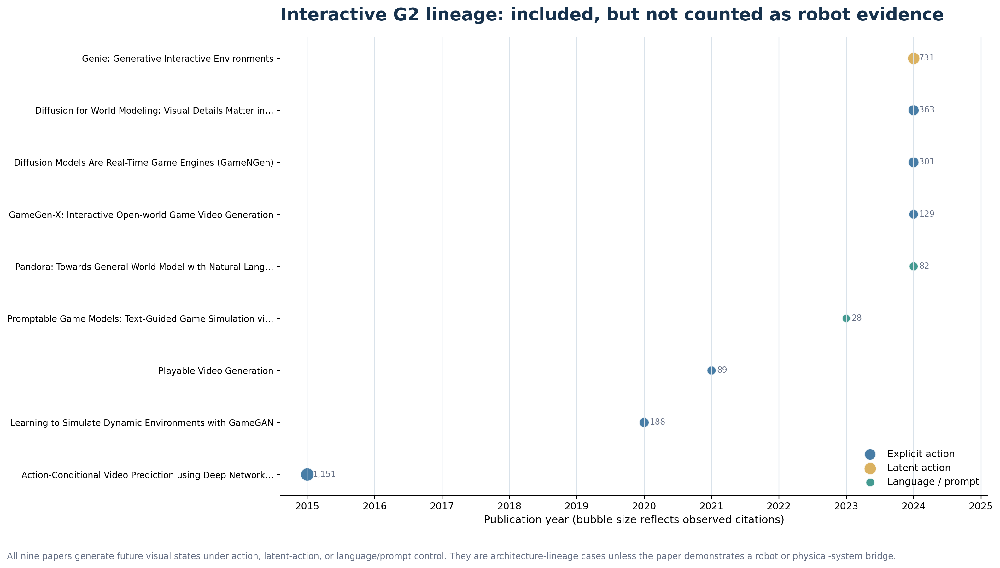
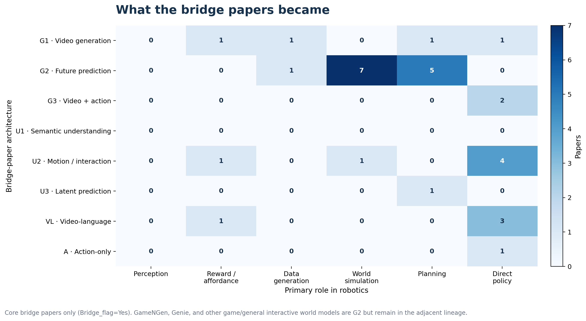

# 비디오 모델은 어떻게 로보틱스로 이어졌나

**한국어** | [English](https://2seungeun.github.io/2seungeun/notes/01-video-to-robotics-transition/english.html)

이승은 · 2026년 9월 1일

비디오를 하던 사람들이 요즘 로보틱스로 많이 넘어간 것 같다는 인상에서 시작했다. 실제로 그런 흐름이 있는지 보려면 사람의 현재 소속만 볼 게 아니라, 원래 어떤 비디오 문제를 풀었는지와 그 경험이 로봇에서 어디에 쓰였는지를 같이 봐야 했다.

그래서 사람 단위로 57명, 논문 단위로 55편을 따로 모았다. 논문은 **로봇 연구로 이어진 것이 논문 안에서 확인되는 31편**, **로봇 실험은 없지만 같은 기술 흐름을 보여주는 17편**, **비디오나 로보틱스 한쪽의 대표 사례라 비교 기준으로 남긴 7편**으로 나눴다. 엑셀에서는 이 세 묶음을 각각 `Yes`, `Adjacent`, `No`로 표시했다. 사람과 논문은 1:1로 대응하지 않는다. 한 논문에 여러 연구자가 참여하고 한 연구자도 여러 논문에 걸친다. 연구자 순서를 계산할 때만 각 사람에게 대표 비디오 논문과 로보틱스 논문을 한 편씩 골랐다.

## 전환이라기보다는 경계가 섞이고 있었다

57명은 다음 네 유형으로 나뉜다.

| 유형 | 인원 | 이 글에서의 의미 |
|---|---:|---|
| Switcher | 2 | 주 연구 주제나 조직이 비디오에서 로보틱스·월드 모델로 뚜렷하게 이동 |
| Bridger | 42 | 두 분야에서 중요한 작업을 했거나 아키텍처를 직접 연결 |
| Native hybrid | 11 | 비교적 이른 시기부터 비디오와 로보틱스를 함께 연구 |
| Robotics-first | 2 | 로보틱스가 중심이고 비디오 출발 근거가 약한 비교군 |

좁은 의미의 전환은 2명뿐이었다. 그보다는 두 분야를 계속 오가거나, 비디오에서 쓰던 구조를 로봇 문제에 옮긴 `Bridger`가 42명으로 훨씬 많았다. 나머지 13명은 처음부터 두 분야를 함께 한 `Native hybrid` 11명과 과대해석을 막기 위해 남겨 둔 `Robotics-first` 비교군 2명이다.

그래서 ‘비디오 연구자들의 대규모 이동’보다는 ‘두 연구 영역의 경계가 빠르게 섞이고 있다’고 보는 편이 맞아 보였다. 나 역시 비디오에서 월드 모델을 거쳐 로보틱스로 관심이 옮겨진 경우라 이 흐름이 더 궁금했던 것 같다.

## 같은 비디오 모델이라도 로봇에서 맡는 역할은 달랐다

처음에는 비디오 생성과 이해 정도만 나누면 될 줄 알았다. 그런데 논문을 모아 놓고 보니 그 안에서도 경로가 달랐다.

비디오 생성에서 미래 장면을 생성하거나 예측하는 모델은 world simulation과 planning 쪽으로 이어졌다. V-JEPA처럼 미래를 예측하더라도 픽셀을 복원하지 않는 모델은 일반적인 비디오 생성과 묶기 어려워 `latent prediction`으로 따로 뒀다. 모션이나 트래킹을 배우는 모델은 로봇의 perception, affordance, video-conditioned policy로 연결되는 경우가 많았다. Video-language는 영상과 언어를 정렬해 얻은 표현이 reward나 reasoning에 쓰이는 흐름이라, 바로 action을 출력하는 VLA와는 구분했다.

그림에 쓴 코드는 아래처럼 읽으면 된다. 생성·예측 계열은 **무엇을 만들도록 학습했는지**와 **action이 입력과 출력 중 어디에 놓이는지**를 함께 보고 G1, G2, G3, A로 나눴다.

| 코드 | 주 출력 또는 학습 대상 | action의 위치 | 로봇에서 주로 이어진 역할 |
|---|---|---|---|
| G1 | 비디오 픽셀 및 토큰 | 없거나 핵심 조건이 아님 | synthetic data, visual subgoal, video plan |
| G2 | 미래 비디오 및 상태 | 조건으로 받을 수 있지만 출력하지 않음 | world simulation, planning |
| G3 | 비디오 및 미래 상태와 action | 둘을 함께 출력 | direct policy |
| U1 | 행동, 사건, 의미 표현 | 출력 기준으로 나누지 않음 | perception backbone |
| U2 | 모션, 트래킹, 상호작용 표현 | 출력 기준으로 나누지 않음 | perception, reward, policy condition |
| U3 | 미래 latent representation | 조건으로 받을 수 있음 | latent planning |
| VL | video-language 정렬 및 추론 표현 | 출력 기준으로 나누지 않음 | reward, reasoning, policy conditioning |
| A | action trajectory, token | action만 출력 | direct policy |

<strong>게임형 G2는 포함하되 로보틱스 근거에서는 제외했다</strong> <em>(판단 근거와 계보 펼쳐보기)</em>

[GameNGen](https://arxiv.org/abs/2408.14837)과 [Genie](https://arxiv.org/abs/2402.15391)는 아키텍처 기준에는 분명히 들어온다. 과거 화면과 action, 또는 영상에서 학습한 latent action을 조건으로 다음 화면을 만들기 때문에 둘 다 G2다. 다만 두 논문 자체에는 로봇이나 물리 시스템으로의 전이가 없다. 그래서 **로봇 실험은 없지만 같은 기술 흐름을 보여주는 논문**으로 넣고, 엑셀에서만 `Adjacent`라고 표시했다. 31편짜리 직접 연결 통계에서는 제외했다. **G2인가**와 **로보틱스로 실제 이어졌는가**를 별개의 판정으로 본 셈이다.

G3와 A가 모두 `direct policy`로 이어지는 것은 맞다. 둘을 나눈 이유는 로봇에서의 역할이 달라서가 아니라 출력 모달리티와 학습 구조가 다르기 때문이다. G3는 미래의 시각 상태와 action을 함께 만들고, A는 action만 만든다.

먼저 연구자의 출발점만 따로 셌다. 각 사람에게 대표 비디오 출발점 하나와 로보틱스에서의 주 역할 하나를 부여했다. 단, G3와 A는 비디오 연구의 출발점이라기보다 로봇 단계에서 생기는 구조라 이 그림에서는 뺐다.

다음은 사람 대신 직접 연결이 확인된 브리지 논문 31편을 센 그림이다. 여기서는 GR-2와 Cosmos Policy가 `video + action`을 함께 생성하는 G3 direct policy로 나타난다. (참고로 앞 그림에서 G3가 0이었던 것은 G3 논문이 없어서가 아니라, 연구자의 원래 출발점을 세고 있었기 때문임)

## 참고

아래 엑셀에는 이 글에 다 넣지 못한 연구자와 논문의 목록과 판단 근거 등이 포함되어 있다.

- [조사 데이터 내려받기](video_to_robotics_architecture_pilot.xlsx)
- 목록 수정일: 2026-09-02
- 인용수 기준일: 기존 40편은 2026-08-30, 이번에 추가한 15편은 2026-09-02

### 목록을 만든 기준

비디오 생성, 예측, 이해 분야에서 대표 작업을 한 뒤 로봇 학습이나 embodied AI에서 중요한 논문을 쓴 경우를 먼저 찾았다. 한 논문 안에서 비디오 모델이 perception, reward, data generation, world simulation, planning, policy에 직접 사용된 경우도 포함했다.

컴퓨터 비전과 로보틱스를 모두 했다는 이유만으로 넣지는 않았다. 로봇 조직으로 소속이 바뀐 것만으로도 전환이라 부르지 않았다. 로보틱스에서는 중요하지만 비디오 출발점이 약한 연구자는 `Robotics-first` 비교군으로 일부 남겼다.

`Evidence_strength`는 전환 유형과 별개의 근거 등급이다. 비디오와 로보틱스 양쪽에서 직접 저자로 참여한 논문이나 공식 프로젝트 역할을 확인할 수 있으면 `High`로, 한쪽 연결이 팀 단위 발표/최근 프로젝트 페이지/간접적인 아키텍처 계보에 기대거나 직접 저자 여부를 충분히 확인하지 못했으면 `Medium`으로 두었다.

`Citation_coverage`는 이와 별개다. 대표 비디오 논문과 로보틱스 논문의 ID가 모두 논문 표에 있고, 두 인용수까지 채워졌으면 `Both selected papers covered`다. ID, 연결, 인용수 중 하나라도 빠지면 `Partial / missing selected-paper coverage`로 뒀다. 현재 57명 중 10명이 Partial이다. 이 열은 연구 연결의 신뢰도가 아니라 **점수를 계산할 자료가 완성됐는지**를 뜻한다. Partial 사례의 Bridge Impact는 0이 아니라 `N/A`이며 순위에서도 제외했다.

### 인용수는 누적값과 연차 보정값을 같이 봤다

논문을 처음 정리했을 때는 `Landmark`, `Major`처럼 정성적인 등급만 붙였다. 그런데 이 방식은 내가 먼저 떠올린 사람이나 익숙한 논문을 앞에 놓기 쉬웠다. 그래서 논문 순서를 실제 인용수 기준으로 다시 잡았다.

다만 누적 인용수만 쓰면 2016년 논문과 2025년 논문을 같은 조건에서 비교하게 된다. 최신 논문을 보기 위한 보조값으로 다음과 같이 발표 후 연차를 나눈 값도 계산했다.

$$
\text{Citations per year}
= \frac{\text{Observed citations}}
{\max(1,\ 2026-\text{publication year}+1)}
$$

예를 들어 2025년 논문은 2년 차, 2023년 논문은 4년 차로 계산했다. 정확한 월 단위 citation velocity나 분야 보정값은 아니고, 오래된 논문이 무조건 유리해지는 것을 확인하기 위한 단순한 보정이다. 엑셀의 기본 순서는 브리지 논문을 먼저 둔 뒤 누적 인용수로 정렬했고, 바로 옆 열에 `Citations_per_year`를 넣었다.

아래 그림의 왼쪽은 누적 인용수, 오른쪽은 이 연차 보정값이다. 오래된 기반 논문은 왼쪽에서 강하고, Cosmos나 V-JEPA 2처럼 최근 논문은 오른쪽에서 상대적으로 올라온다.

연구자도 전체 커리어 인용수로 줄 세우지는 않았다. 이 글에서 보고 싶은 것은 비디오와 로보틱스 **양쪽**에서 확인되는 영향력이었기 때문이다. 양쪽에서 중요한 작업이 확인된 사람을 먼저 두고, 대표 비디오 논문과 로보틱스 논문의 인용수를 기하평균했다.

$$
\text{Bridge Impact}
= \sqrt{(C_{video}+1)(C_{robotics}+1)} \times w_{evidence}
$$

근거가 `High`이면 1.0, `Medium`이면 0.8을 곱했다. 0.8은 통계적으로 추정한 계수가 아니라, 연결 근거가 덜 직접적인 사례를 보수적으로 낮추기 위한 규칙이다. 한쪽 논문만 인용수가 큰 사람이 지나치게 올라가지 않도록 산술평균 대신 기하평균을 썼다. `Important_both=Yes`이고 두 대표 논문의 coverage가 모두 있는 사람만 계산했다. 이 기준에서는 Chelsea Finn, Sergey Levine, Ming-Yu Liu, Oier Mees, Thomas Brox가 앞에 놓였다.

### 이 숫자를 그대로 순위표로 보기는 어렵다

이 순위는 애초에 비디오와 로보틱스 양쪽에서 중요한 작업이 확인된 사람을 먼저 고른 뒤, 그 교집합 안에서 계산했다. 따라서 두 분야에 이미 잘 알려진 연구자가 위로 오는 것은 지표의 결과인 동시에 표본을 고른 방식의 결과이기도 하다. 새로운 전환자를 독립적으로 찾아내는 점수나 전체 연구자의 영향력 순위로 읽으면 안 된다.

이 목록 자체도 전수조사가 아니라 흐름을 보기 위해 고른 표본이다. 대표 논문을 한두 편만 선택하면서 빠지는 기여가 있고, 하나의 bridge paper가 비디오와 로보틱스 양쪽 근거가 되기도 한다. 공동저자의 실제 기여도도 인용수로는 나눌 수 없다.

인용수 자체도 계속 변한다. arXiv와 학회·저널 버전이 따로 잡히면 검색 서비스마다 숫자가 다르고, 2025–2026년 논문은 몇 달 사이 순위가 크게 달라질 수 있다. 연차 보정값도 이런 문제를 해결하는 지표라기보다 오래된 논문과 최신 논문을 한 번 더 나눠 보는 참고값이다.

그래도 생성, 이해, video-language를 한 덩어리로 세지 않고 로봇에서 맡는 역할까지 연결해 보니 처음의 막연한 인상은 조금 달라졌다. 사람의 이동 자체보다, **비디오에서 배운 표현과 예측 구조가 로봇의 world model, planning, policy로 옮겨가는 과정**이 더 큰 흐름에 가까웠다.

